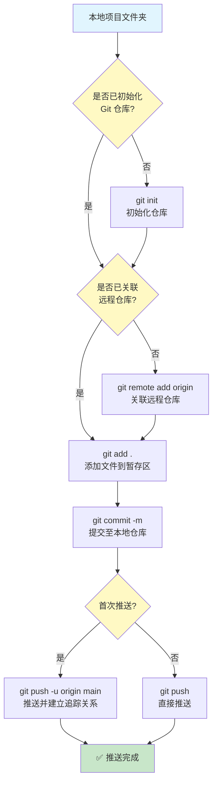
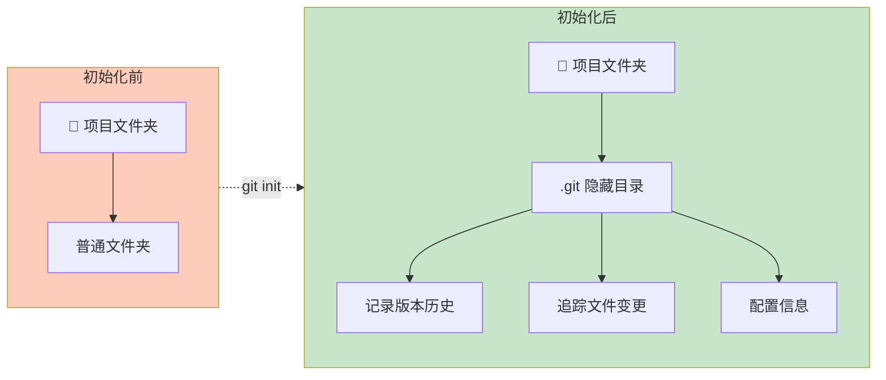
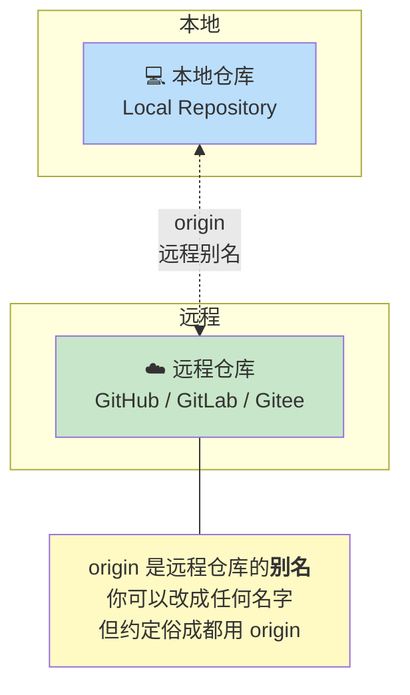
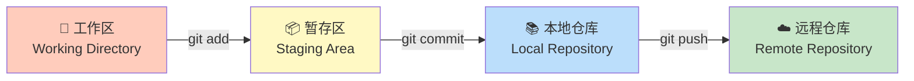
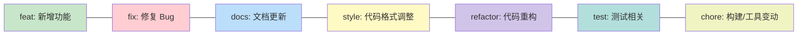
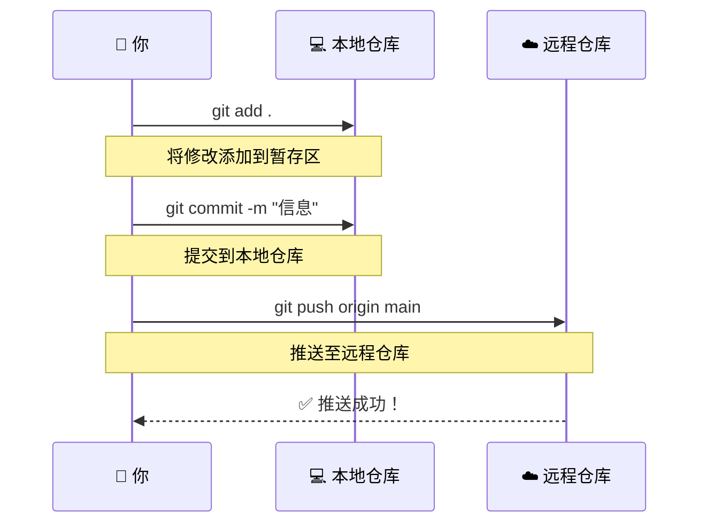
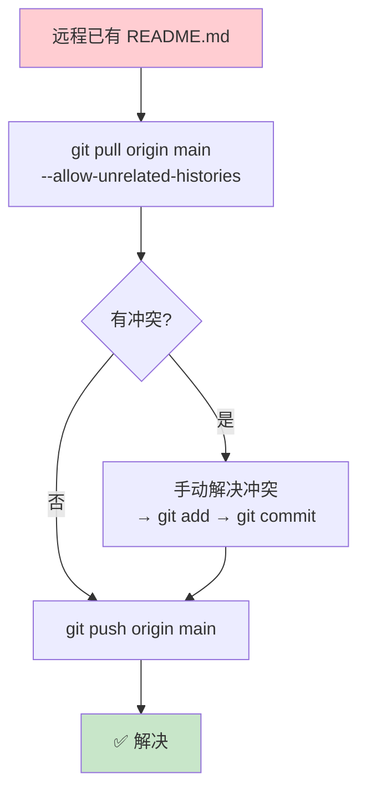
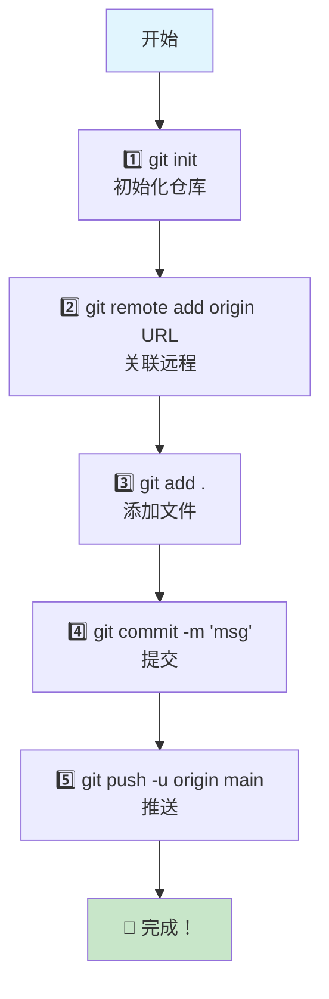

# 📅 Day 4：Git 本地文件推送远程仓库完整指南

> **日期**：2026年6月21日（周日）
> **状态**：✅ 已完成
> **核心产出**：Git 推送操作文档 + Mermaid 流程图

---

## 🎯 核心流程图（总览）



---

## 📋 一、前置准备：初始化 Git 仓库

### 操作命令

```bash
# 1. 进入项目目录
cd 你的项目路径

# 2. 初始化 Git 仓库
git init

# 3. 查看仓库状态（验证是否成功）
git status
```

### 关键概念图解



> 💡 `.git` 目录是 Git 的核心，存储了所有版本控制的元数据。删除 `.git` 目录就等于"解除"版本控制。

---

## 🔗 二、关联远程仓库

### 操作命令

```bash
# 方式1：HTTPS（推荐新手使用）
git remote add origin https://github.com/用户名/仓库名.git

# 方式2：SSH（需要先配置 SSH Key）
git remote add origin git@github.com:用户名/仓库名.git

# 查看已关联的远程仓库
git remote -v

# 如果填错了，先删除再重新添加
git remote remove origin
git remote add origin 新的地址
```

### 关系图解



---

## 📝 三、添加文件到暂存区

### 工作区 → 暂存区 → 本地仓库



### 常用命令

```bash
# 添加所有文件
git add .

# 添加指定文件
git add index.html style.css

# 添加指定文件夹
git add src/

# 交互式添加（可以部分暂存）
git add -p

# 查看暂存区状态
git status
```

---

## 📦 四、提交到本地仓库

### 操作命令

```bash
# 提交并附上说明信息
git commit -m "feat: 初始化项目结构"

# 如果漏了文件，可以追加到上一次提交（不产生新提交记录）
git add 漏掉的文件
git commit --amend -m "feat: 初始化项目结构（补充）"
```

### 提交信息规范



> 📌 推荐格式：`类型: 简短描述`，如 `feat: 添加用户登录功能`

---

## 🚀 五、推送到远程仓库

### 完整推送流程



### 操作命令

```bash
# 首次推送（建立追踪关系）
git push -u origin main

# 后续推送（已绑定上游分支）
git push

# 强制推送（⚠️ 慎用！会覆盖远程历史）
git push --force
```

### 分支名对照

| 场景 | 分支名 |
|------|--------|
| GitHub 2020年后新建仓库 | `main` |
| GitHub 旧仓库 / GitLab | `master` |
| 查看当前分支 | `git branch` |

---

## ⚠️ 六、常见问题与解决

### 问题 1：远程仓库已有文件（如 README）



```bash
# 解决方案
git pull origin main --allow-unrelated-histories
# 如果有冲突，手动解决后再：
git add .
git commit -m "merge: 合并远程 README"
git push origin main
```

### 问题 2：认证失败

| 方式 | 说明 |
|------|------|
| **HTTPS + Token** | 用 Personal Access Token 代替密码 |
| **SSH Key** | 一劳永逸，生成 `ssh-keygen` 后添加到 GitHub |
| **凭据缓存** | `git config --global credential.helper cache` |

### 问题 3：推送被拒绝（non-fast-forward）

```bash
# 先拉取远程最新代码
git pull origin main --rebase

# 解决冲突后再推送
git push origin main
```

---

## 🎯 极简速查表



| 步骤 | 命令 | 说明 |
|------|------|------|
| ① | `git init` | 初始化仓库（仅首次） |
| ② | `git remote add origin URL` | 关联远程（仅首次） |
| ③ | `git add .` | 添加到暂存区 |
| ④ | `git commit -m "信息"` | 提交到本地 |
| ⑤ | `git push -u origin main` | 推送到远程（首次用 -u） |

---

## 📌 补充：.gitignore 文件

在推送前，建议创建 `.gitignore` 忽略不需要版本控制的文件：

```gitignore
# 依赖
node_modules/
vendor/

# 环境文件
.env
.env.local

# 系统文件
.DS_Store
Thumbs.db

# IDE 配置
.idea/
.vscode/
*.swp
```

---

> 📝 **一句话总结**：`git init → git add → git commit → git push`，记住这四步就好！
